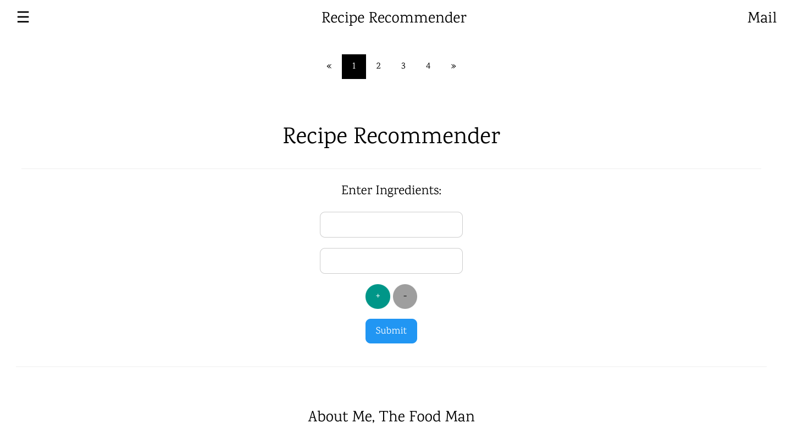
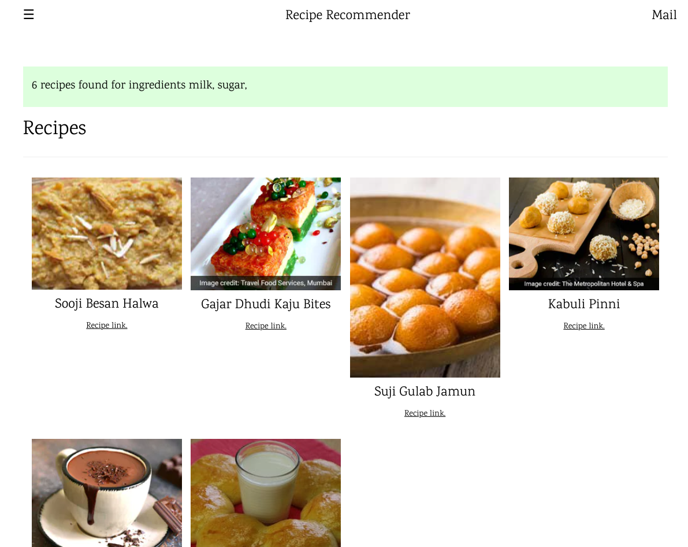

# Recipe Recommender System

||
|-------------------------|
| Interface for app       |

||
|-------------------------|
| Result of the query     |

## Setup 

### Database

- Download and install `noe4j`
  [https://neo4j.com/download/](https://neo4j.com/download/)
- Open `neo4j` and create `New Project`
- Name the project `Recipe Recommendation`
- Create a new database `Recipes` and set password `123`
  and select the `Graph DB` as its type.
- Now import the `csv file for into the project
  [Resource](https://neo4j.com/developer/desktop-csv-import/)
- Now create the associations

```
LOAD CSV WITH HEADERS FROM 'file:///recipes_img.csv' AS row
WITH row WHERE row.name IS NOT NULL
MERGE (rec:recipe {name: row.name, time:row.time, link:row.link, image:row.image})
WITH rec, row
UNWIND split(row.ingredient, ',') AS i
MERGE (c:ingredient {name:  lTrim(rTrim(i))})
MERGE (rec)-[r:NEED]->(c)
```

Note:

- Neo4j database internal structure
  - Neo4j desktop store database inside its application folder 
    (`~/.config/Neo4j Desktop/relate-data/dbmss` on linux).
  - Each database have its own folder (e.g. `dbms-9ffccc4b-5842-4e9a-91d8-7b1edd4a53b4`)
  - The `.csv` file to be imported are stored in the `/import` subdirectory.

### Starting web app

- `cd nodejs-app`
- `npm install` - install node modules
- `node app` - launch node app

#### For development

- `npm install nodemon -g`
- `nodemon`

# License

[MIT](./LICENSE)